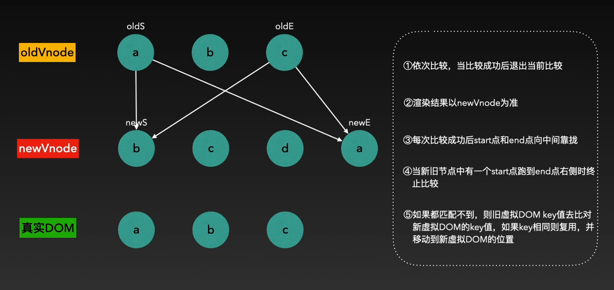

个人对diff算法一直都是一知半解，没有系统的去了解去尝试去理解，这里就对diff算法初级理论进行一个掌握，当个人能力水平更近一些时，再去理解模拟底层源码，原理

### diff算法的基础原理

diff算法是基于虚拟DOM所使用的，进行比较的是同级节点，这里我们模拟一段虚拟DOM，虚拟DOM就是构建的js对象，之后渲染值页面显示为真实DOM

```javascript
<div class='container'>
   <p class='item'>1</p>
	<p class='item'>2</p>
	<p class='item'>3</p>
	<p class='item'>4</p>
</div>

<script>
   //主要包含tagName标签名，props标签中的属性，text标签内的文本，children包含的子元素，依次向下
   let Vnode = {
      tagName: "div";
      props: {
      'calss': 'container';
   },
      //子节点
      children:[
         {
            tagName: 'p';
            props: {'item',};
         	text: '1';
         }，
         {
            tagName: 'p';
            props: {'item',};
         	text: '2';
         },
         {
            tagName: 'p';
            props: {'item',};
         	text: '3';
         }，
         {
            tagName: 'p';
            props: {'item',};
         	text: '4';
         },
      ]
   }
</script>
```

内容进行修改之后会触发VUE的响应式原理，通知view进行更新，在这个过程中会进行一些比较，diff算法就体现在具体的比较过程中

**更新节点过程(DIff算法)**

1. isSameVnode：Vnode是同类标签吗？不是直接进行替换

2. oldvonde和newvnode是否相等：

   相等   return

   不相等分情况进行比较(同级比较)

   - oldVnode与newVnode: 用新文本节点替代旧文本节点
   - old没子节点，new有子节点：增加新的子节点(添加最前appendChild()/添加至最后insertBefore())
   - old有子节点，new没有子节点：删除子节点removeChild()   (以上三种方法并不是diff算法用来修改节点的方法，原因很简单，修改的是虚拟DOM，也就是对象，并不是DOM元素，只是个人复习回忆，别被误导，创建是内部封装了createElement函数，删除好像是innerHTML='',具体不太了解)
   - old，new都有子节点时：**updateChildren利用Diff算法进行比较(也就是本此的核心)**

这里是如何比对的呢，**首先旧节点的start(第一个元素)比对新节点的start，没有比对成功就去比对新节点的end节点(最后一个节点)，如果此时还是没有比对成功，那么使旧节点的end比对newVnode的start，没有比对成功那么就去比对end，当某一个节点比对成功之后，就会向内部节点移动，继续开始进行上述比对，直到start移动至end后一个元素停止比对，此时就会使用key再去查看新的虚拟节点有没有相同的key值，有则复用，没有就去creatElement创建元素**

### 为什么不建议使用index作为元素的key值

为什么不建议使用index作为key值呢，其实道理也很简单，当我们使用v-for进行循环时，key获取下标值，作为元素的唯一标识符

```
简单的演示
<span key=0>1<span>   下标0
<span key=1>2<span>   下标1
<span key=2>3<span>	  下标2
对应数组值
[1,2,3]
假设我们删除数组中的第二个元素  此时数组[0,2]   对应元素可以下标还是0，1
也就是说，vue人会认为我们的操作是删除了下标2的元素<span key=2>3<span>，而不是删除了下标1的元素<span key=1>2<span>
此时vue通知响应式原理会进行删除元素操作，并且对<span key=1>2<span>进行修改成<span key=1>3<span>，然后页面进行重新渲染
我们原本想要的操作应该是直接删除<span key=1>2<span>  然后直接复用下标0的元素和下标2的元素(实际中数组内大多多个对象，内含id，id对应数据，可实现复用)，但是由于使用的是index，key值只有key=2消失了，也就完全没起到我们想象中的复用，而是复用了错误的元素数据，从而进行了一系列的vue组件元素更新与删除/创造，以及生命周期函数的流程，这样只是浪费性能
还有当我们对数组进行翻转sort，reserve时，也只是数据发生改变，而key值并没有，也会导致Vnode的重绘，完全没有达到复用的效果
```

大致理解就是如此，总结就是若对数据进行：逆序添加、逆序删除等破坏顺序操作:会产生没有必要的真实DOM更新 ==> 界面效果没问题, 但效率低。
