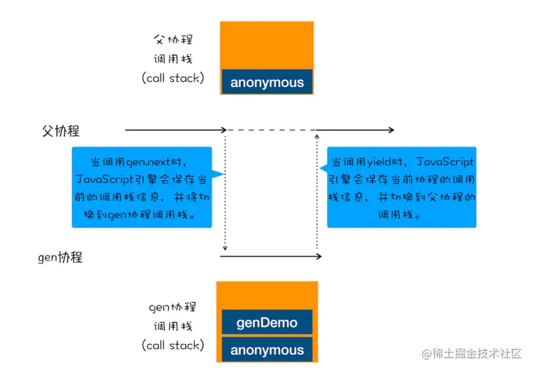

## 1.异步变同步的实现

`async`函数其实就是生成器（generator）函数的语法糖，最强大之处就是将异步变成同步(主线程)执行，这是怎么做到的呢,`js`是单线程执行，所以异步变同步是一个很神奇的地方，相关资料文档： https://juejin.cn/post/6978689182809997320#comment

原理：

- 通过调用生成器函数 `genDemo` 来创建一个 **协程 `gen`**，创建之后，`gen` 协程并没有立即执行。
- 要让 `gen` 协程执行，**需要通过调用 `gen.next`**。
- 当协程正在执行的时候，可以 **通过 `yield` 关键字来暂停 `gen` 协程的执行**，并返回主要信息给父协程。
- 如果协程在执行期间，遇到了 `return` 关键字，那么 JS 引擎会结束当前协程，并将 `return` 后面的内容返回给父协程。

协程之间的切换：

- `gen` 协程和父协程是在主线程上交互执行的，并不是并发执行的，它们之前的切换是 **通过 `yield` 和 `gen.next` 来配合完成** 的。

- 当在 `gen` 协程中调用了 `yield` 方法时，JS 引擎会保存 `gen` 协程当前的调用栈信息，并恢复父协程的调用栈信息。同样，当在父协程中执行 `gen.next` 时，JS 引擎会保存父协程的调用栈信息，并恢复 `gen` 协程的调用栈信息。

  

这样就可以更好的理解`async`函数的原理

## 2.`async`与`Promis`的结合使用

最常使用的就是`async`函数结合`axios`请求返回数据，因为`axios`返回的就是一个Promise，在项目中也在`axios`发起的请求中决定返回的状态是resolve，一般都是在请求之后进行一些处理封装

```javascript
//登陆请求    
const Login = () => {
      // 通过校验就发送请求(valid=true)
    proxy.$refs.form.validate(async (valid) => {
      if (valid) {
        // 接收返回的axios请求数据
        let res = await proxy.$api.getMenu(proxy.formUser);
        console.log(res);
      }

//请求的处理       
// 创建axios实例  设置基础路径
const service = axios.create({
  // 将基础路径设置为环境路径
  baseURL: config.baseApi,
});

 //对请求之后的处理
service.interceptors.response.use((response) => {
  // 对数据进行一些处理,这样请请求之后就是最直接的数据
  const { code, data, msg } = response.data;
  if (code == 200) {
    return data;
  } else {
    // 网络请求错误,有返回错误信息就返回没有就报网络异常
    ElMessage.error(data.msg || NETWORK_ERROR);
    //  如果错误返回错误状态的Promise回调
    return Promise.reject(data.msg || NETWORK_ERROR);
  }
});
       
//成功返回一个数据即可，默认是成功状态并将数据返回resolve(data)，当失败时,返回失败状态的Promise并传递错误信息，await接受到返回的Prmise状态与数据提至同步执行
```

