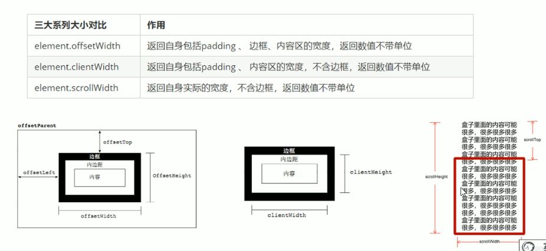

这里我们先回忆一下盒子顶部与父盒子高度知识



这里还存在一个window属性也能起到相关作用，那就是window.pageYoffset，含义是指页面向上被卷去的高度，实际使用

```javascript
<body>
    <div class="slider-bar">
      <span class="goBack">返回顶部</span>
    </div>
    <div class="header w">头部区域</div>
    <div class="banner w">banner区域</div>
    <div class="main w">主体部分</div>
    <script>
      //window.pageYOffset是获得（页面）向上被卷去的内容高度  左侧就是window.pageXOffset 页面左侧被卷去内容宽度
      //1.获取元素
      var sliderbar = document.querySelector(".slider-bar");
      var banner = document.querySelector(".banner");
      var main = document.querySelector(".main");
      var span = document.querySelector("span");
      var goBack = document.querySelector("goBack");
      var bannerTop = banner.offsetTop; 
//可以不写在上方，因为banner.offsetTop不随scroll滚动变化
      var sliderbarTop = sliderbar.offsetTop - bannerTop;
      //移动到banner上方时就改变侧边栏位置  而offsettop又是动态数值  后期不用修改
      //这里的 sliderbarTop 必须写在上方 var得到具体数值  不能写在函数内，因为函数滚动鼠标触发事件，侧边栏slider上方被卷去的大小是动态改变的，这样就会影响后面的 top 位置
      document.addEventListener("scroll", function () {
        //在页面文档上滚动，滚动对象自然是document
        if (window.pageYOffset >= bannerTop) {
          sliderbar.style.position = "fixed";
          sliderbar.style.top = sliderbarTop + "px";
        } else {
          sliderbar.style.position = "absolute";
          sliderbar.style.top = "300px";
        }
        if (window.pageYOffset >= main.offsetTop) {
          span.style.display = "block";
        } else {
          span.style.display = "none";
        }
      });
      // 返回顶部
      span.addEventListener("click", function () {
        // 注意这个scroll（）不需要添加px单位
        window.scroll(0, 0);
      });
    </script>
  </body>
```

以上使用是**通过监听scroll来操作DOM元素的样式修改display以及盒子高度位置**，提升用户体验的方法，基于上述使用，也就可以引出对于数据，图片懒加载的方式也是**基于scrol监听事件，满足滚动高度条件从而去加载数据/图片/图片链接/歌曲链接**等

那么**如何进行懒加载呢，此时就需要将要加载的属性进行设置为自定义属性，将src改变成data-src，系统将无法解析加载数据/图片**，当需要加载时，我们在js将其设置回来，这样就实现了懒加载

## 1.利用滚动scroll对数据/图片等进行懒加载

### 这里就利用图片进行举例，首先先了解两个高度

- 窗口显示区高度:window.innerHeight    （小提一嘴自适应布局我们就是使用window.innerWeight来控制rem根字体大小从而改变布局）

- 知道显示区高度之后，我就来需要知道**图片顶部高度到显示器顶部高度**，这里我们可以使用几种方法，具体看使用场景

  1. ```javascript
     //scrollTop距离顶部高度，pageYoffset，页面被卷去的高度
     window.pageYoffset - scrollTop >= 0;  //到达显示区
     ```

     

  2. ```javascript
     //同理还有offsetTop（到父元素顶部距离）
     window.pageYoffset - offsetTop >= 0;  //到达显示区
     ```

     

  3. ```javascript
     //推荐使用元素的getgetBoundingClientRect()方法
     //getBoundingClientRect():返回一个 DOMRect 对象，其提供了元素的大小及其相对于视口的位置。
     //scrollTop，offsetTop，getgetBoundingClientRect().top均为只读属性，pageYoffset，innerHeight动态属性
     window.innerHeight - getgetBoundingClientRect().top >=0;
     ```

     附图getgetBoundingClientRect()返回值元素方法返回值.png)

### 接下来就开始编写懒加载的代码

```javascript
//假设有几张图片在显示区下方,并且已将src属性变成data-src属性
<script>
   //获取图片
   const images = document.querySelectorAll('img');
	
	//监听滚动scroll
	window.addEventListener('scroll',(e)=>{
      images.forEach((image)=>{
         const imageTop = image.getgetBoundingClientRect().top
         //图片到达显示区
         if(imageTop < window.innerHeight){
            //获取每一张图片data-src
            const data_src = image.getAttribute('data-src');
            //修改成src属性 (setAttribute设置属性)
            image.setArribute('src',data_src);
         }
            console.log('懒加载成功了');
      })
   })
</script>
```

**==注意==：这个方法的不足之处就是当我们加载完成之后，监听的scroll还是会不断触发事件，也就导致资源浪费，但是如果我们使用removeEventListener移除监听又不确定是否还有其它资源需要懒加载，所以几乎不太使用这个种方法**

## 2.通过`IntersectionObserver()`交叉观察构造函数懒加载(推荐方法)

此方法是基于浏览器提供的**`IntersectionObserver`** 接口对象，提供了一种异步观察目标元素与其祖先元素或顶级文档视窗 ([viewport](https://developer.mozilla.org/zh-CN/docs/Glossary/Viewport)) 交叉状态的方法，也就是当显示区(视口)与内容交叉时触发函数(原生方法，有兼容性问题)

此接口提供了`observer.observe`(DOM节点)观察节点，与`observer.unobserve`取消观察，也就为完善了scroll方法的缺点

```javascript
const observer = new IntersectionObserver(callback,option)
//主要是利用观察到与没观察到来触发回调函数callback
```

我们再来了解以下**`IntersectionObserver`** 接口对象，`new IntersectionObserver(callback，option)`，接收两个参数，主要使用第一个参数callback，回调函数callback有又接收两个参数`callback(entries,observer)`

**`entries`是`observe`方法观察的dom元素的组成的一个数组，里面是经过封装的每一个dom元素对象，当对象被观察`observe`与未被观察`unobserve`会改变内部dom元素对象中的`isIntersecting`(是否交叉也就是是否到达可视区域)属性值true/false**

分别会触发一次callback,也就是方便我们对函数进行处理

`observer`(被调用的`IntersectionObserver`实例)，不做多了解

具体实现代码

```javascript
//假设有几张图片在显示区下方,并且已将src属性变成data-src属性
<script>
   //获取图片
	const images = document.querySelectorAll('img');

	//设置观察实例
	const observer = new IntersectionObserver(callback);

	images.forEach((image)=>{
      //观察每一个节点显示区是否交叉，交叉之后触发会回调函数callback
      observer.observe(image)
   })

	const callback = (entries)=>{
      entries.forEach((entry)=>{
         //如果当前节点被观察到了
         if(entry.isIntersecting){
         //获取被观察到的当前dom节点
         //这里的target是指的isIntersecting为true时的那一个节点
            const image = entry.target;
            //获取图片data-src属性
            const data_src = image.getAttribute('data-src');
            //修改成src属性 (setAttribute设置属性)
            image.setArribute('src',data_src);
            
       //当数据加载完成我们就取消对此dom元素的观察防止再次触发函数(节省资源)
            observer.unobserve(image)
         }
      })
   };
</script>
```


