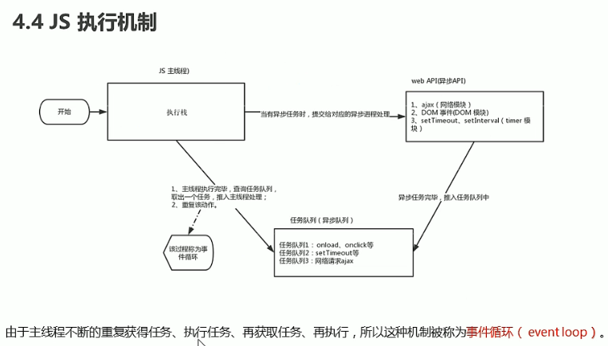

## 1.事件循环

我们知道`js`是单线程执行,单线中又存在同步任务与异步任务，在`js`执行机制中，存在loop任务循环，简单来说就是执行完同步任务之后，会从文件中获取的例如`ajax请求`，`dom`事件，`setTimeout`定时器等异步任务，主线程会不断查询任务队列，推入主线程中执行，不断重复该动作就是事件循环(event loop)

附图

接下来对异步任务进行细分

## 2.异步任务(宏任务，微任务)

这里进行划分主要是对`promise`中的then进行处理规划，清楚任务进行过程中的顺序，防止编程中的数据获取出错

在`js`执行过程中执行顺序为：**任务执行: 主线同步-> 微任务 -> 异步任务(也称宏任务)**，Promise中的then方法就是微任务，接下来代码举例

```javascript
    <script>
      setTimeout(() => {
        console.log("微任务");
      }, 0);
      new Promise((resolve) => {
        resolve(); //成功
        console.log("Promise");
      }).then((value) => {
        console.log("宏任务");
      });
      console.log("后盾人");
      // 依次打印 Promise  后盾人 宏任务 微任务
    </script>
```

在宏任务内部嵌套微任务时，由于异步任务是提至主线程进行执行，所以显示执行宏任务，再去执行微任务

```javascript
    <script>
      let promise = new Promise((reslove) => {
        setTimeout(() => {
          reslove();
           //如果传递reject()错误状态; 
           //后面状态是无效的，当已经传递状态之后无法改变then的状态了
          console.log("宏任务");
        }, 0);
        console.log("Promise");
      }).then((value) => {
        console.log("微任务");
      });
      console.log("同步");
      //Promise 同步 宏任务 微任务
    </script>
```

