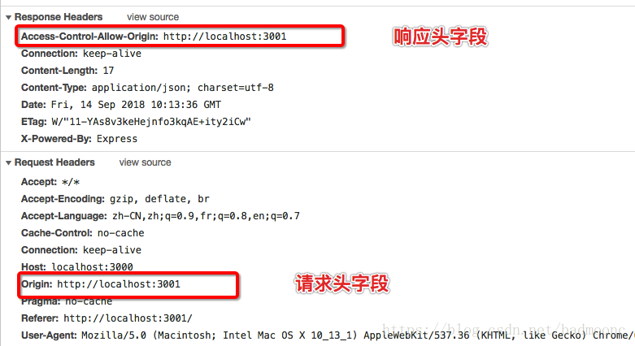

## 1.利用JSONP实现跨域

主要原理就是是利用script标签不受跨域同源策略(`http`协议，域名，端口号一致)限制，**通过`src`属性向后台发送一个带有回调参数的get请求，而后获取回调函数中的参数中的数据**，同源策略限制表现:`cookie`,`LocalStorage `跨域不能读取修改

最初的`jquery`就是通过`JSONP`取巧发送跨域请求的

```javascript
<script>
    var script = document.createElement('script');
    script.type = 'text/javascript';

// 传参一个回调函数名给后端，方便后端返回时执行这个在前端定义的回调函数
    script.src = 'http://www.domain2.com:8080/login?user=admin&callback=handleCallback';
//通过HEAD请求方式添加script标签实现跨域
    document.head.appendChild(script);

    // 回调执行函数
    function handleCallback(res) {
        alert(JSON.stringify(res));
    }
 </script>
服务端返回如下（返回时即执行全局函数）：

handleCallback({"success": true, "user": "admin"})
```

**`jsonp`缺点：**

- 由于只是一个html标签，只有get方法，只能获取也就无法发送post请求
- 在请求失败时，不会返回各类`http`状态码
- 使用`jsonp`不安全，回调函数`callback`参数可能被恶意修改，修改成一些获取例如`cookie`携带用户信息的请求，那么用户的隐私可能被泄露，这也就时所谓的**`XXS`攻击**(**解决方法就是替换字符串，防止发送参数为脚本，变成普通文本，也就不会执行脚本**)

## 2.`CORS`跨域资源共享

先附上一些常见的请求头

- Accept：可接受的相应内容类型(Content-Type)；

- Accept-Language：可接受响应内容的语言列表；

- Accept-Charset：可接受的字符集；

- Accept-Encoding：可接受的响应内容的编码方式；

- Accept-Datetime：用于表示HTTP协议中需要认证资源的认证信息；

- Cache-Control:用来指定当前的请求、回复中是否使用缓存机制；

- Connection：keep-alive/Upgrade客户端（浏览器有限使用的连接类型）

- Cookie:用于服务器与客户端间的通讯；

- Content-Length:以8进制表示的请求体的长度；

- Content-Type：请求体的MIME类型（用于POST和PUT请求中）Content-type：application/x-www-form-urlencoded;

- Date:发送该消息的日期和时间；

- Expect：表示客户端服务器做出特定的行为；

- Referer：表示浏览器所访问的前一个页面，可以认为是之前访问页面的链接将浏览器带到了当前页面。Referer其实是Referrer这个单词，但RFC制作标准时给拼错了，后来也就将错就错使用Referer了。

- User-Agent：浏览器的身份标识字符串

**响应头**

- Access-Control-Allow-Origin：指定哪些网站可以跨域源资源共享
- Accept-Ranges：服务器所支持的内容范围
- Age：响应对象在代理缓存中存在的时间，以秒为单位
- Cache-Control：通知从服务器到客户端内的所有缓存机制，表示它们是否可以缓存这个对象及缓存有效时间。其单位为秒
- Connection：针对该连接所预期的选项
- Content-Disposition：对已知MIME类型资源的描述，浏览器可以根据这个响应头决定是对返回资源的动作，如：将其下载或是打开。
- Content-Encoding：响应资源所使用的编码类型。
- Content-Language：响就内容所使用的语言
- Content-Length：响应消息体的长度，用8进制字节表示；
- Content-Location：所返回的数据的一个候选位置；
- Content-Range：如果是响应部分消息，表示属于完整消息的哪个部分
- Content-Type：当前内容的MIME类型
- Date：此条消息被发送时的日期和时间(以RFC 7231中定义的"HTTP日期"格式来表示)
- ETag：对于某个资源的某个特定版本的一个标识符，通常是一个 消息散列；是否更新；
- Expires：指定一个日期/时间，超过该时间则认为此回应已经过期
- Set-Cookie：设置HTTP cookie
- Server：服务器的名称

### 简单请求

**请求方式使用下列方法之一：**
GET
HEAD
POST

**Content-Type(实际发送数据类型) 的值仅限于下列三者之一：**
`text/plain`(纯文本格式)
`multipart/form-data`(表单上传文件时的格式)
`application/x-www-form-urlencoded`(表单编码后的key/value格式)

`cors`允许浏览器跨源向服务器发送`XMLHttpRequeset`,前提是浏览器(兼容性)与服务器同时支持才可实现跨域，主要通过后端设置服务器相关`cors`头部字段，针对一些简单请求(get，head，post)利用`Access-Control-Allow-Origin`设置允许跨域的源，服务器接收到该源跨域请求则会成功返回，如图

### 非简单请求

**使用了下面任一 HTTP 方法：**
PUT(修改，替换服务器资源)
DELETE(删除)
CONNECT(简历资源表示的服务器隧道)
OPTIONS(获取服务器支持的`http`请求方式)
TRACE(测试)
PATCH(对已知资源进行更新)

**Content-Type 的值不属于下列之一:**
`application/x-www-form-urlencoded
multipart/form-data
text/plain`

对于非简单请求，**服务器会先发送一个`options`请求’预检‘**，先查看是否支持该请求方式，支持则会发送请求至后端，不支持则会抛出错误

```javascript
// 前端代码
var url = 'http://localhost:2333/cors';
var xhr = new XMLHttpRequest();
xhr.open('PUT', url, true);
xhr.setRequestHeader('X-Custom-Header', 'value');
xhr.send();
```

**通过上述非简单请求方式我们可知，遇见是通过`options`来进行请求的**

```javascript
//预检请求
OPTIONS /cors HTTP/1.1
Origin: localhost:2333
Access-Control-Request-Method: PUT // 表示使用的什么HTTP请求方法
Access-Control-Request-Headers: X-Custom-Header // 表示浏览器发送的自定义字段
Host: localhost:2332
Accept-Language: zh-CN,zh;q=0.9
Connection: keep-alive
User-Agent: Mozilla/5.0...
```

```javascript
HTTP/1.1 200 OK
Date: Mon, 01 Dec 2008 01:15:39 GMT
Server: Apache/2.0.61 (Unix)
Access-Control-Allow-Origin: http://localhost:2332 // 表示http://localhost:2332可以访问数据
Access-Control-Allow-Methods: GET, POST, PUT      
Access-Control-Allow-Headers: X-Custom-Header    
Content-Type: text/html; charset=utf-8
Content-Encoding: gzip
Content-Length: 0
Keep-Alive: timeout=2, max=100
Connection: Keep-Alive
Content-Type: text/plain
```

确定可发送请求之后就和简单请求一样，发送请求，返回数据


请求成功就返回数据，这里附上一些`cors`字段

（1）Access-Control-Allow-Methods

该字段必需，它的值是逗号分隔的一个字符串，表明服务器支持的所有跨域请求的方法。注意，返回的是所有支持的方法，而不单是浏览器请求的那个方法。这是为了避免多次"预检"请求。

（2）Access-Control-Allow-Headers

如果浏览器请求包括Access-Control-Request-Headers字段，则Access-Control-Allow-Headers字段是必需的。它也是一个逗号分隔的字符串，表明服务器支持的所有头信息字段，不限于浏览器在"预检"中请求的字段。

（3）Access-Control-Allow-Credentials

该字段与简单请求时的含义相同,可选字段，即是否可以发送`cookie`。

（4）Access-Control-Max-Age

该字段可选，用来指定本次预检请求的有效期，单位为秒。上面结果中，有效期是20天（1728000秒），即允许缓存该条回应1728000秒（即20天），在此期间，不用发出另一条预检请求。

## 3.利用webpack Proxy代理实现跨域

proxy也就是`vue-cli`使用的跨域代理配置

原理：`proxy`工作原理实质上是利用`http-proxy-middleware` 这个`http`代理中间件，实现请求转发给其他服务器，当本地发送请求的时候，代理服务器响应该请求，并将请求转发到目标服务器，目标服务器响应数据后再将数据返回给代理服务器，最终再由代理服务器将数据响应给本地

在代理服务器传递数据给本地浏览器的过程中，两者同源，并不存在跨域行为，这时候浏览器就能正常接收数据，通过避开浏览器的同源策略完成跨域请求

```javascript
  // 配置跨域devServe服务  vite搭建配置跨域就是serve,路径重写也不一致
  devServer: {
    // 配置跨域委托代理Proxy
    proxy: {
      "/path": {
        target: "https://i.maoyan.com", //替换的服务端地址
        changeOrigin: true, //开启代理
        pathRewrite: {
          "^/path": "",
        },
      },
    },
```

注意：**服务器与服务器之间请求数据并不会存在跨域行为，跨域行为是浏览器安全策略限制**

